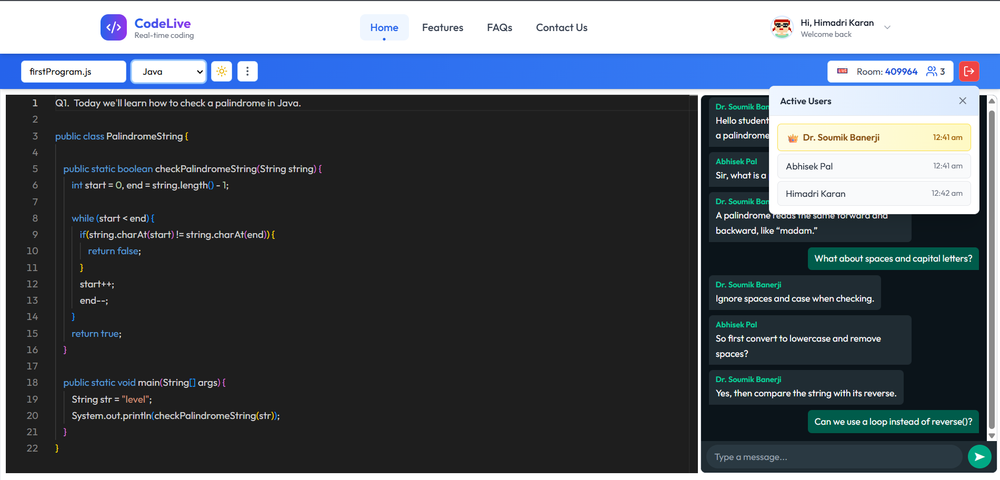
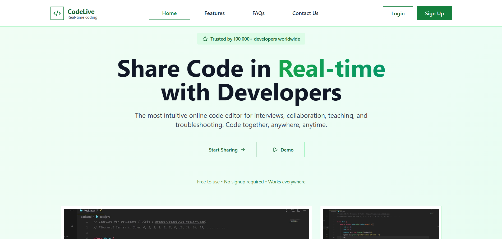
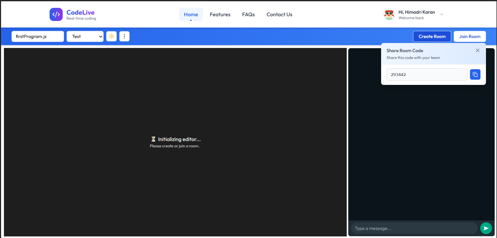
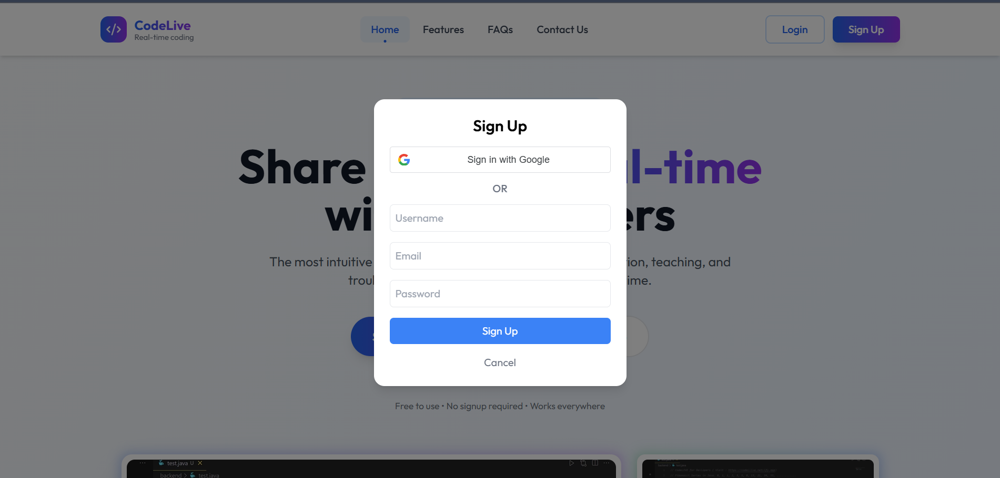

# 🚀 CodeLive - Real-Time Collaborative Code Editor

<div align="center">

<table>
  <tr>
    <td></td>
    <td>
      <h1>CodeLive</h1>
      <em>Build Faster Together</em>
    </td>
  </tr>
</table>

**A powerful real-time collaborative coding platform for seamless remote interviews, pair programming, and team collaboration.**

[](https://reactjs.org/)
[](https://github.com/microsoft/monaco-editor)
[](https://nodejs.org/)
[](https://socket.io/)
[](https://github.com/yjs/yjs)
[](https://groq.com)

[Features](#-features) • [Tech Stack](#-tech-stack) • [Getting Started](#-getting-started) • [Architecture](#-architecture) • [Contributing](#-contributing)

</div>

---

## 📋 Overview

**CodeLive** is a full-stack web application that enables multiple users to code together in real-time. Built with modern web technologies, it provides a seamless experience for collaborative coding sessions, technical interviews, and educational purposes. The platform combines the power of Monaco Editor (VS Code's editor) with real-time synchronization using Yjs and WebSocket technology. Recent updates introduce **AI-assisted code generation** via a Groq-powered endpoint for rapid scaffolding and experimentation.

---
## 📸 **Project Screenshots**

<table width="100%">
  <tr>
    <td align="center" colspan="3">
      <br/>
      <b>Code Editor & Chat</b><br/>
      <sub>Real-time collaborative coding with integrated chat</sub>
    </td>
  </tr>
  <tr>
    <td align="center" width="33%">
      <br/>
      <b>Landing Page</b><br/>
      <sub>Responsive homepage with feature highlights</sub>
    </td>
    <td align="center" width="33%">
      <br/>
      <b>Room Management</b><br/>
      <sub>Track users and manage coding rooms efficiently</sub>
    </td>
    <td align="center" width="33%">
      <br/>
      <b>Authentication Page</b><br/>
      <sub>Google OAuth and guest login system</sub>
    </td>
  </tr>
</table>


---

## 🌟 Features

### Collaborative Editing
- **Live Code Synchronization** - Changes appear instantly for all participants
- **Multi-language Support** - JavaScript, Python, Java, C++, and more
- **Monaco Editor Integration** - VSCode-like editing experience in the browser
- **Cursor Tracking** - See where other users are editing in real-time

### Communication
- **Real-time Chat** - Text messaging within coding rooms
- **User Presence** - Track active participants with join/leave notifications
- **Timestamp Tracking** - See when users joined the session

### Room Management
- **Unique Room IDs** - Create or join rooms with shareable identifiers
- **User Count Display** - Real-time count of active participants
- **Graceful Disconnection** - Automatic cleanup when users leave

### User Experience
- **Google OAuth** - Quick and secure authentication
- **Guest Access** - Join with temporary usernames
- **Theme Toggle** - Switch between light and dark modes
- **Responsive UI** - Built with Tailwind CSS for modern aesthetics

### AI Assistance
- **Prompt-Based Code Generation** – Generate clean code snippets via `/api/ai/generate` (Groq Llama 3.3 model).
- **Raw Output Enforcement** – Backend strips markdown/backticks for direct editor insertion.
- **Simple Frontend Hook** – `useAI().generateCode(prompt)` from the `AiContext`.
- **Graceful Failures** – Clear errors for missing/invalid API key.

---

## 🎯 Use Cases

- **Technical Interviews** - Conduct remote coding interviews with real-time collaboration
- **Pair Programming** - Work together on code with team members
- **Code Reviews** - Review and discuss code changes in real-time
- **Teaching & Learning** - Educators can teach coding concepts interactively
- **Hackathons** - Collaborate with team members during coding competitions

---

## 🛠 Tech Stack

### Frontend
| Technology | Purpose |
|------------|---------|
| **React 18.3** | Modern UI library with hooks and context API |
| **Redux Toolkit** | State management for authentication and app state |
| **Tailwind CSS** | Utility-first CSS framework for responsive design |
| **Monaco Editor** | Professional code editor (VSCode's editor) |
| **Socket.IO Client** | Real-time bidirectional communication |
| **Yjs** | CRDT for conflict-free collaborative editing |
| **React Router** | Client-side routing and navigation |
| **Lucide React** | Beautiful icon library |
| **Vite** | Fast build tool and development server |

### Backend
| Technology | Purpose |
|------------|---------|
| **Node.js** | JavaScript runtime environment |
| **Express.js** | Web application framework |
| **Socket.IO** | Real-time WebSocket communication |
| **Yjs + y-websocket** | Collaborative editing synchronization |
| **CORS** | Cross-origin resource sharing |
| **dotenv** | Environment variable management |
| **Groq SDK** | AI code generation (Llama models) |

---

## 🏗 Architecture

```
┌────────────────────────────────────────────────────────────┐
│                         Frontend (React)                   │
│  ┌──────────────┐  ┌──────────────┐  ┌──────────────┐      │
│  │  Monaco      │  │   Socket.IO  │  │     Yjs      │      │
│  │  Editor      │  │   Client     │  │   Provider   │      │
│  └──────────────┘  └──────────────┘  └──────────────┘      │
└────────────────────────────────────────────────────────────┘
                              │
                              │ WebSocket + HTTP
                              │
┌────────────────────────────────────────────────────────────┐
│                      Backend (Node.js)                     │
│  ┌──────────────┐  ┌──────────────┐  ┌──────────────┐      │
│  │   Express    │  │  Socket.IO   │  │  Y-Websocket │      │
│  │   Server     │  │   Server     │  │   Server     │      │
│  └──────────────┘  └──────────────┘  └──────────────┘      │
│          ┌──────────────┐                                  │
│          │   Groq AI    │  (/api/ai/generate)              │
│          └──────────────┘                                  │
└────────────────────────────────────────────────────────────┘
```
---

## 🚀 Getting Started

### Prerequisites

Make sure you have the following installed:
- **Node.js** (v16 or higher)
- **npm** 

### Installation

1. **Clone the repository**
   ```bash
   git clone https://github.com/karanhimadri/Codelive.git
   cd Codelive
   ```

2. **Setup Backend**
   ```bash
   cd Backend
   npm install
   ```

   Create a `.env` file:
   ```bash
   # Backend/.env
   PORT=8080
   GROQ_API_KEY=your_groq_key_here
   ```

3. **Setup Frontend**
   ```bash
   cd ../Frontend
   npm install
   ```

### Running the Application

1. **Start the Backend Server**
   ```bash
   cd Backend
   npm start
   ```
   Server will run on `http://localhost:8080`

2. **Start the Frontend Development Server**
   ```bash
   cd Frontend
   npm run dev
   ```
   Application will open on `http://localhost:5173`

### Using AI Code Generation (Optional)

1. Ensure `GROQ_API_KEY` is set in `Backend/.env`.
2. From the frontend, access the context:
   ```jsx
   import { useAI } from './context/AiContext';
   const { generateCode } = useAI();
   const code = await generateCode('Create a Fibonacci function in Python');
   ```
3. The backend returns raw code (no markdown) ready for editor insertion.

---

## 👨‍💻 Developer Profile

**Himadri Karan**  
*Backend Developer & Software Engineer*

- 📧 **Email**: [Karanhimadri1234@gmail.com](mailto:Karanhimadri1234@gmail.com)
- 💼 **LinkedIn**: [linkedin.com/in/himadrikaran](https://linkedin.com/in/himadrikaran)  
- 🌐 **Portfolio**: [Himadri.me](https://himadri.me)
- 🐙 **GitHub**: [github.com/karanhimadri](https://github.com/karanhimadri)

---

<div align="center">

**Made with ❤️ and lots of ☕**

If you found this project helpful, please give it a ⭐️!

</div>
